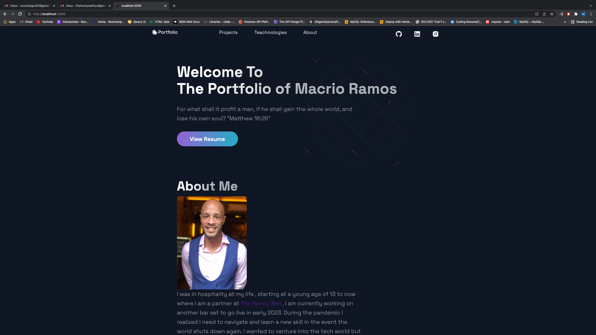

# react-tome
Fully functioning  React Portfolio

## Description 

* This is my React Portfolio. Using react and Next.js.

## User Story 

* AS AN employer looking for candidates with experience building single-page applications
I WANT to view a potential employee's deployed React portfolio of work samples
SO THAT I can assess whether they're a good candidate for an open position

## Features

* Responsive Design Mobile First.
* Links to all projects and to relating Github page.
* Links to my personal Github, Linkedin, And Instagram.
* Contact Links in Footer that allow opening of an email box and the ability to call me . 

## Dependencies

* [yarn.lock]https://classic.yarnpkg.com/lang/en/docs/yarn-lock/

## Installation

* This Portfolio does not need installation , but if you must , download code open in vs code and npm i & npm start

## License

* MIT 

## Credits 

* [Marcio Ramos]{https://github.com/Jump89}

## Resources 

* https://www.w3schools.com/  Used a lot of components for this Portfolio

## Front End

* [React]
* [Javascript]
* [Styled-Components]https://styled-components.com/
* [Styled-Normlize]https://www.npmjs.com/package/styled-normalize
* [React-icons]https://react-icons.github.io/react-icons/search?q=di

## Backend

* [node.js]https://nodejs.org/en/
* [Next.js]https://nextjs.org/

## Repo

* (https://github.com/Jump89/react-tome)

## Heroku Link

* No Walk Through Video for this Application

## Screen Shoot of Application

* 
